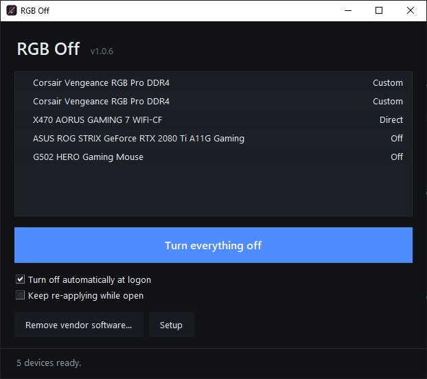

# RGB Off

**Turn off every RGB LED in a Windows PC — and keep it off.**

Motherboard headers, ARGB fans and strips, RAM, GPU, peripherals. One button, one app, no vendor bloatware.

[](https://github.com/LuhOnCoffee/rgb-off/actions/workflows/ci.yml)
[](LICENSE)
[](https://github.com/LuhOnCoffee/rgb-off/releases/latest)
[](https://github.com/LuhOnCoffee/rgb-off/releases)



---

## Why

Turning RGB off should be trivial and isn't. Each vendor ships its own control panel — Armoury Crate, iCUE, Mystic Light, RGB Fusion — every one of them a background service that reasserts its lighting profile the moment anything else touches the hardware. Getting to "dark" usually means installing four apps you don't want, or living with a rainbow.

RGB Off does it in one place, on top of [OpenRGB](https://openrgb.org), and it removes the vendor software that would otherwise fight it.

## Install

Grab the latest **`RGBOff-x.y.z-Setup.exe`** from [Releases](https://github.com/LuhOnCoffee/rgb-off/releases) and run it.

> **SmartScreen will warn you.** The build isn't code-signed — a certificate costs a few hundred dollars a year and this is a free tool. Click **More info → Run anyway**, or [build it yourself](#building-from-source) and trust your own binary.

On first launch, press **Setup**. It installs what's missing:

- **OpenRGB** — the engine that talks to every vendor's controllers.
- **PawnIO** — a signed driver OpenRGB needs for SMBus access. Without it your RAM, GPU and most motherboard controllers never appear at all. (Older OpenRGB used WinRing0; that's gone, and if you have it lying around from other software you should remove it.)

Then use **Remove vendor software…** to clear out anything that would fight the blackout.

## Using it

| | |
|---|---|
| **Turn everything off** | The button. Everything OpenRGB can reach goes dark. |
| **Turn off automatically at logon** | Registers a scheduled task. Tick this — see [why it's usually needed](#why-the-lights-come-back). |
| **Keep re-applying while open** | For controllers that revert the second the client disconnects. |
| **Remove vendor software…** | Scans, groups by risk, removes through each vendor's own uninstaller. |
| **Setup** | Installs OpenRGB and PawnIO if missing, enables the SDK server, and reports every step. Only needed once. |
| Tray icon | Right-click → turn off without opening the window. Closing the window hides the app to the tray rather than quitting it; use **Quit** in the tray menu to exit. |

There's a console build too, `rgboff-cli.exe`, for scripts and scheduled tasks:

```
rgboff-cli --list             show detected devices and the mode each will use
rgboff-cli --off              blackout, then exit
rgboff-cli --off --hold       blackout and keep re-applying every 5s
rgboff-cli --color 202020     dim grey instead of off
```

It is deliberately *not* called `rgboff.exe`: Windows filenames are
case-insensitive, so that name and `RGBOff.exe` are the same file and could
not coexist in the install folder.

## How the blackout picks a mode

For each device, by mode name, best first:

1. **`Off`** — the controller's own blackout. Stored on the device, often survives a reboot.
2. **`Static`** — colour stored on the controller, so it sticks after the app exits.
3. **`Direct`** — the host drives the LEDs live.
4. **`Custom`** — what Corsair and some others call their per-LED mode.

That fourth entry matters more than it looks. Corsair Vengeance RGB Pro DDR4 exposes *no* `Off`, `Static` or `Direct` — only `Custom` plus a list of effects. A tool that only knows the first three finds nothing, pushes black at RAM still running Rainbow Wave, and reports success while your memory keeps cycling. There's [a regression test](tests/test_core.py) for exactly this.

If none of those names exist, it falls back to whichever mode the controller *flags* as per-LED, and then to a mode-specific one — blanking that mode's stored colour slots first, so it doesn't come up in whatever colour it remembered.

Then every LED is set to `#000000` and the controller is asked to save the mode to its own flash. Devices that refuse a step are reported and skipped; one stubborn device never aborts the run.

## Removing vendor software

The scanner walks the Windows uninstall registry and matches against a catalog of ~20 programs. Results come back in two groups:

- **Safe to remove** — lighting only. Ticked by default.
- **Does more than RGB** — also runs fan curves, pump speed, DPI or macro profiles. Unticked by default, each with a line saying what you'd lose.

Removal runs each vendor's **own uninstaller** — the registry's `QuietUninstallString`, or `msiexec /x` for MSI packages, or a detected Inno/NSIS silent switch. Nothing is force-deleted and no service is ripped out from under itself. An installer with no known silent switch opens its own window for you to click through, rather than being fed guessed flags that might do something other than uninstall.

**Armoury Crate is a known exception.** A normal uninstall reliably leaves services behind; the app flags this and points you at ASUS's own removal tool.

Losing fan or pump control isn't dangerous — the hardware falls back to BIOS or firmware curves. It may just run louder than your tuned profile until you set curves in BIOS.

## Why the lights come back

Most controllers reset to rainbow on power-up, and only some can store an "off" state. Corsair DDR4 and Gigabyte boards, for two common examples, have no `Off` or `Static` mode at all — they can only be held dark by the host. So a reboot brings the lights back, and that's the hardware, not a bug.

That's what **run at logon** is for. If lighting returns a few *seconds* after a blackout with no vendor software installed, that's a different thing: a controller watchdog reverting on disconnect. Use the hold option.

## Troubleshooting

| Symptom | Cause |
|---|---|
| `PawnIO module initialization aborted (code=-2147023728)` | PawnIO isn't installed. Press **Setup**, then reboot. |
| Zero devices detected | No admin rights, PawnIO missing, or vendor software still holding the hardware. |
| RAM and GPU stay lit, everything else goes dark | Same two causes — check the status lines at the top of the window. |
| `Failed to find superio in the executable's directory` | Affects a few motherboard fan/LED controllers only. SMBus is unaffected. |
| `[<some device>] No matching device found` | OpenRGB probing for hardware you don't own. Noise. |
| Lights return after reboot | Expected on most hardware. Tick **run at logon**. |
| Lights return seconds later | Controller watchdog. Tick **keep re-applying**. |
| One strip stays on no matter what | Check the BIOS for *Aura / RGB LED in S5* or *Onboard LED* — firmware standby lighting, unreachable from software. |
| A device isn't listed at all | OpenRGB doesn't support it yet, or it needs a per-vendor plugin. |

## Building from source

```bash
git clone https://github.com/LuhOnCoffee/rgb-off
cd rgb-off
pip install -e ".[gui,dev]"
pytest                       # 57 tests, no hardware needed
python -m rgboff             # run the app
```

The tests run against a fake `openrgb` module ([`tests/conftest.py`](tests/conftest.py)), so mode selection is verified on any OS without OpenRGB installed or a single LED attached. The release workflow additionally reads the PE subsystem of each built executable, so a console build can never ship as the GUI one again.

To produce the installer yourself, push a `v*` tag — [the release workflow](.github/workflows/release.yml) builds both executables with PyInstaller and packages them with Inno Setup on a Windows runner. Or run those two steps locally on Windows.

## Layout

```
src/rgboff/
  core.py        device logic: connect, pick a mode, blank it   (fully tested)
  vendors.py     catalog, registry scan, uninstall planning     (fully tested)
  server.py      find OpenRGB, start its SDK server, PawnIO
  autostart.py   scheduled tasks, created from XML via schtasks
  elevation.py   admin checks
  gui.py         tkinter window + pystray tray icon
  cli.py         argument parsing, shared by both builds
```

`core.py` imports `openrgb` lazily inside functions specifically so the logic can be tested without the library present.

## Support the project

RGB Off is free and always will be. If it saved you an afternoon, you can
[sponsor me on GitHub](https://github.com/sponsors/LuhOnCoffee) or
[buy me a coffee on Ko-fi](https://ko-fi.com/luhoncoffee). Reporting a device
that stays lit is worth just as much — see [CONTRIBUTING.md](CONTRIBUTING.md).

## License

**GPL-3.0** — see [LICENSE](LICENSE).

That isn't a stylistic choice. The released executables bundle
[`openrgb-python`](https://github.com/jath03/openrgb-python), which is GPL-3.0,
so the combined binary has to be GPL-3.0 too. You may use, modify, sell and
redistribute it; anyone you pass it to gets the same rights and the source.
[THIRD-PARTY-NOTICES.md](THIRD-PARTY-NOTICES.md) has the full dependency
breakdown.

OpenRGB itself (GPL-2.0) and PawnIO are *not* bundled — they are separate
programs this app talks to, and installing them is up to you.

Not affiliated with or endorsed by OpenRGB, PawnIO, or any hardware vendor.
Product names identify the software they refer to, nothing more.
